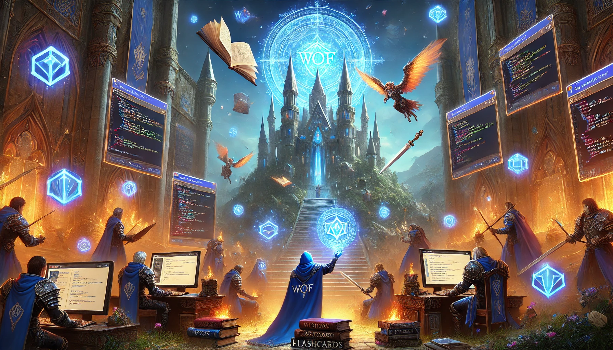

# World of Flashcards

Bienvenue dans World Of Flashcards (WOF), un environnement dans lequel vous allez apprendre puis démontrer votre maîtrise du framework [AdonisJS](https://adonisjs.com/) !

Vous y serez accompagné par votre prof non joueur (PnJ) auquel vous pourrez demander conseil et assistance, et à qui vous remettrez vos quêtes achevées pour qu'il vous attribue les points d'expérience (px) qui vous feront gagner des niveaux.

Avant toute chose, écoutez-le vous guider à travers le processus de configuration...

Et foncez dans le tas ...

## Configuration d'une partie de WOF

### Préparation (prof)

- Tous les élèves ont un compte sur l'infra IceScrum ETML (https://etml.icescrum.com) et __pas__ sur le IceScrum public (https://www.icescrum.com/). Leur nom d'utilisateur doit permettre de les identifier sans ambiguité (p.ex: `Lucas 2` n'est pas OK)
- Envoyer la liste des élèves au Game Master (XCL)
- Le GM
  - Intégre les élèves à l'équipe WOO
  - Inscrit le prof comme Product Owner des projets WOO-Master et WOO-Player
  - Fournit l'export du projet WOO-Player

### Installation (PnJ+joueurs)

1. Tous: allez sur le repo Woo sur [Github](https://github.com/ETML-INF/WOO) (pas besoin de se connecter)
2. Tous: Téléchargez le ZIP de ce repo (sous `Code`)
3. Tous: Extrayez le dossier `WOO-main` de ce zip et placez-le dans vos dossiers de travail sous le nom de `WOO` 
4. Tous: Connectez-vous à https://etml.icescrum.com
5. Joueurs: Importez le projet WOO-Player qui vous a été transmis. Lors de l'importation, vous aurez un message de conflit de clé de projet. Changez la clé `WOOXXXXXXX` en `WOOIIIYYYY`, où `III` sont vos initiales (p.ex: `GBY` pour Gérard Bellamy) et `YYYY` est l'année en cours. Exemple: `WOOGBY2024`. Notez cette clé, vous allez en avoir besoin plus loin.
6. PnJ: Collecte toutes les clés de projets créées par les joueurs
7. Joueurs: dans les settings du projet (shift-S), changez le nom du projet `WOO-Player` en `WOO-Gérard`
8. Tous: dans les détails de votre compte IceScrum (cliquez sur l'avatar, puis MyAccount > Account), sélectionnez l'onglet `API tokens`. Créez un token nommé 'WOO', copiez-le dans le presse-papier
9. Quittez IceScrum et ouvrez le dossier WOO
10. Joueurs: 
  - Ouvrez le fichier `Player Config.html`.
  - Collez le token que vous venez de mettre dans le presse-papier
  - Saisissez la clé de projet (`WOOGBY2024`)
  - Téléchargez le fichier de configuration
  - Déplacez-le dans votre dossier WOO
11. PnJ:
  - Renomme `_icescrum_api.js.example` en `_icescrum_api.js`
  - Colle ton token dans le fichier
  - Place toutes les clés de projet dans le tableau `projectIds`

Votre configuration est achevée si vous obtenez quelque chose comme ceci en ouvrant le fichier `Player.html`

